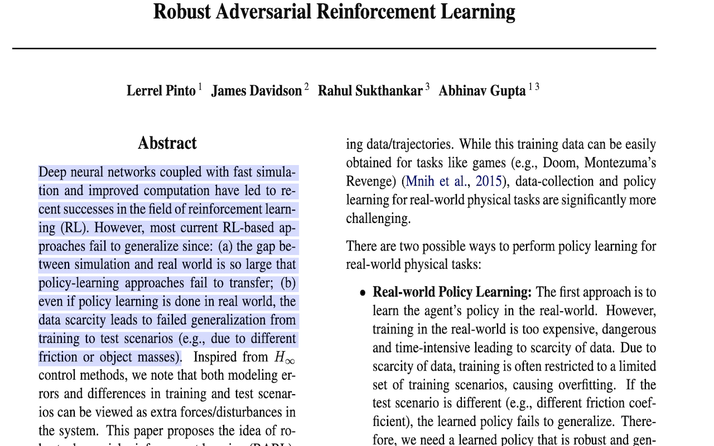
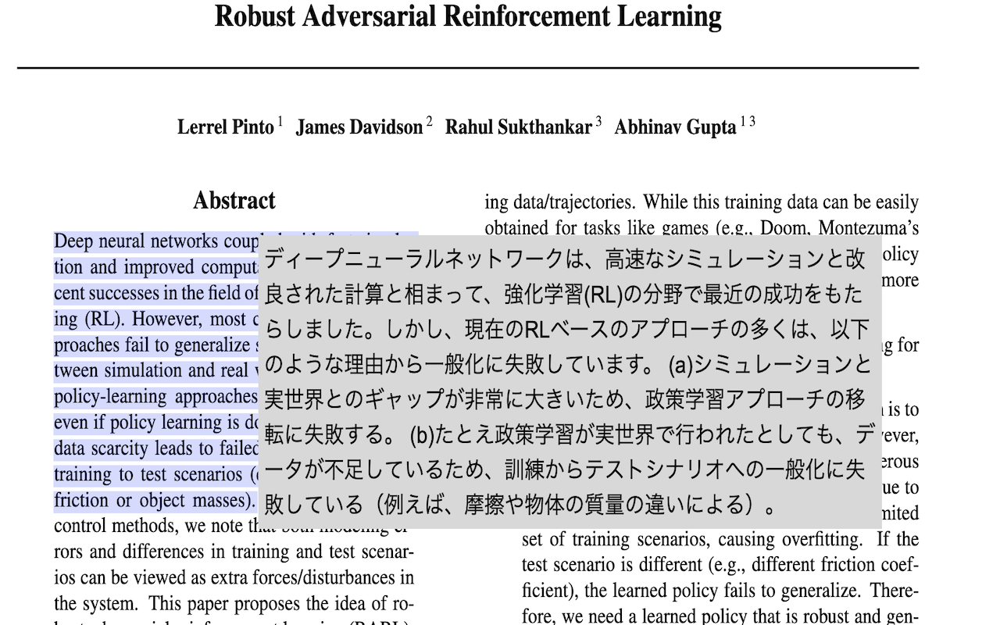

# PDF Translator

## Overview
This is a Chrome extension that automatically corrects selected text directly from a PDF file and displays the translation results at DeepL.

This is an "unofficial" chrome extension and we are not responsible for any disadvantages caused by this extension.

The following languages are supported.
- English
- 日本語
- Deutsche
- Français
- Español
- Português
- Italiano
- Nederlands
- Polski
- русский
- 汉语

This Chrome extension includes 4 corrections to produce a clean translation for DeepL.
- Remove line breaks in the middle of a sentence.
- Remove "-" from a word.
- "A space is inserted immediately after ". Insert a space if there is a capital letter immediately after the ".
- A new line is inserted immediately after ";" and ":".

## How to use
1. Select the text you want to translate.

2. It will be translated.

This implementation includes [pdf.js](https://github.com/mozilla/pdf.js).

Icon made by Pixel perfect from www.flaticon.com
