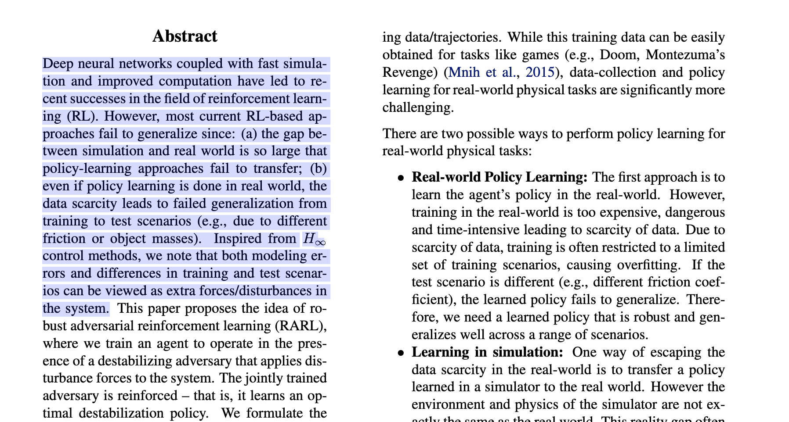
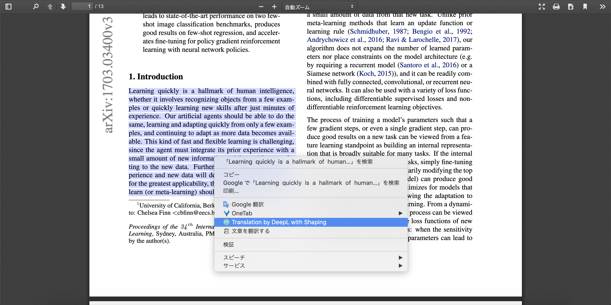

# DeepL Translator for PDF

## 概要
PDFファイルから直接選択したテキストを自動で補正してDeepLで翻訳した結果を表示するChrome拡張です．
## 内容
このChrome拡張ではDeepLで綺麗な翻訳を行うための補正が3つ含まれてます．
- 文の途中に含まれている改行を取り除く．
- 単語の中に含まれている"-"を取り除く．
- "."のすぐ後に大文字のアルファベットが含まれている時にスペースを代入する．
## 使い方
1. 翻訳したい文章を選択します．

2. 翻訳されます．

This implementation includes [pdf.js](https://github.com/mozilla/pdf.js).

Icon made by Pixel perfect from www.flaticon.com
